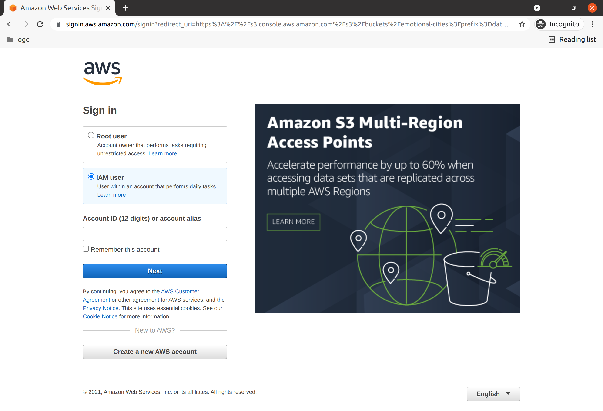
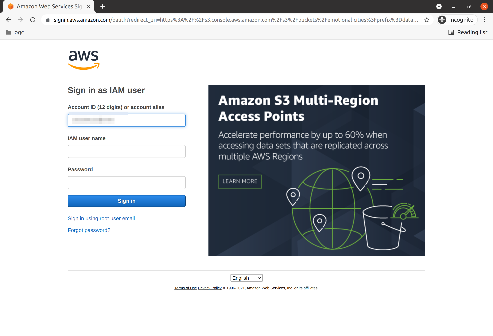
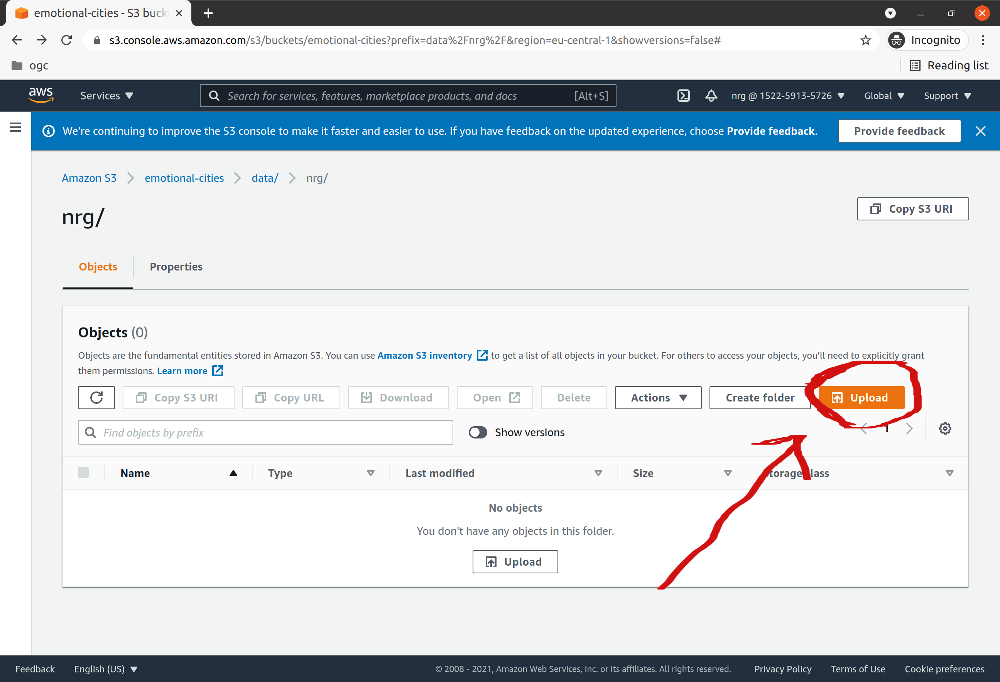

# README

## Objectives
This document provides instructions to load GIS datasets and their attachments into the SDI Data Lake, in the context of the [eMOTIONAL Cities](https://cordis.europa.eu/project/id/945307) project.

This document is addressed to project partners who are responsible for producing data within the project.

## Uploading Your GIS Datasets

When adding your GIS datasets to our spatial data infrastructure, it's important to note the following:

1. **Supported Formats**: We accept a variety of specific GIS dataset formats. This ensures compatibility and streamlines the integration process within our infrastructure. Please ensure your datasets conform to the [accepted formats](https://github.com/emotional-cities/byteroad-workshop/blob/master/data_formats.md) before attempting to upload.

2. **Data Lake Storage**: Instead of working with a structured database, we utilize a data lake. This approach allows for more flexibility, permitting the uploading process to be as straightforward as copying your files over. Our data lake is hosted on Amazon Web Services (AWS) using the S3 Bucket service. Known for its scalability and reliability, S3 ensures that your data is stored securely and can be accessed swiftly when needed.

3. **Data should always be accompanied by metadata**. You should create one metadata record for each submited dataset, using either the metadata survey form or the equivalent spreadsheet. Please get in touch, if you are not sure how to access any of these.

After you submitted both data and metadata, please create an [issue](https://github.com/emotional-cities/data-share/issues/new/choose) on the issue tracker, letting us know you have added data. In alternative, you can just send us an email.

The cutoff date for adding datasets is the **28th of every month**. Datasets added until 00:01:00 CEST of the 28th will be ingested on the following month. You will be notified on your issue, once the datasets are available.

### Note about Updates
If you need to update a dataset, please also [create an issue](https://github.com/emotional-cities/data-share/issues/new?assignees=&labels=&projects=&template=update-existing-dataset.md&title=). Updating data, involves both uploading a dataset and deleting another. When you update a dataset, you should update the existing metadata record, changing only the relevant fields; at the very least, you should fill the field "updated" with the timestamp of the update. The easiest way to do that, is to ask for the excel spreadsheet with your metadata.

## Technology
The repository is hosted on [Amazon Web Services (AWS)](https://aws.amazon.com/), using the [Simple Storage Service (S3)](https://aws.amazon.com/s3/). It is secured using the [AWS Identity and Access Management (IAM)](https://aws.amazon.com/iam/).

## Quick-start

You can upload data to your S3 bucket folder, using a browser through the AWS console, or programatically using an application. Instructions for the two scenarios are provided bellow.
For both cases, you will need to identify yourself by providing some security information (e.g.: credentials). If you do not have this information, please get in touch with ByteRoad through the [gitter channel](https://gitter.im/emotionalcities/community), or by email.

### Access Bucket using a Browser

Open the link to the relevant folder:

https://s3.console.aws.amazon.com/s3/buckets/emotional-cities?region=eu-central-1&prefix=data/nrg/&showversions=false

> **_NOTE:_**   This is just an example. Please find your link in the [Link List](#link-list) section.

Choose the option `IAM User`, and proceed to the next screen.



Use the `username` and `password` to login.



Upload data through the user interface, using the `upload` button. You are able to create sub folders, if you like.



### Access Bucket using an application

There are multiple clients that support access to AWS S3.

On Windows, you can use the [Winscp](https://winscp.net/eng/download.php) client, to [connect to an S3 bucket, using a native protocol](https://winscp.net/eng/docs/guide_amazon_s3). In order to do that, you will need the `access key ID` and `secret access key`.


You can also install the [AWS Python shell](https://aws.amazon.com/cli/), which is available for any OS. You will need to authenticate using the provided credentials. If you are going to use AWS only for this user, you can configure the default credentials, by typing: `aws config` in your terminal.

A complete guide to using AWS CLI, can be found here:
https://docs.aws.amazon.com/cli/latest/userguide/cli-chap-welcome.html


If you plan to use this tool for multiple users, you may want to create a profile for this user. Assuming you want to call your profile `nrg`:

. Edit `~/.aws/config` (path in linux)

Insert the default region for this profile:

```
[nrg]
region = eu-central-1
```

. Edit `~/.aws/credentials` (path in linux)

Insert your credentials:

```
[nrg]
aws_access_key_id = [PASTE YOUR ACCESS KEY ID HERE]
aws_secret_access_key = [PASTE YOUR SECRET ACCESS KEY HERE]
```

To sync the files in your current folder with the folder `nrg` on the AWS bucket, you can type:

```
aws s3 sync . s3://emotional-cities/data/nrg
```

Or, if you are using a profile, append the `--profile` flag:

```
aws s3 sync . s3://emotional-cities/data/nrg --profile nrg 
```

### Bucket Link List

S3 links, per partner:

| Partner | Link |
|---|---|
| CAMB | https://s3.console.aws.amazon.com/s3/buckets/emotional-cities?region=eu-central-1&prefix=data/camb/&showversions=false |  
| CLIMA | https://s3.console.aws.amazon.com/s3/buckets/emotional-cities?region=eu-central-1&prefix=data/clima/&showversions=false |  
| FMUL | https://s3.console.aws.amazon.com/s3/buckets/emotional-cities?region=eu-central-1&prefix=data/fmul/&showversions=false |  
| IGOT | https://s3.console.aws.amazon.com/s3/buckets/emotional-cities?region=eu-central-1&prefix=data/igot/&showversions=false |  
| MSU | https://s3.console.aws.amazon.com/s3/buckets/emotional-cities?region=eu-central-1&prefix=data/msu/&showversions=false |  
| NRG | https://s3.console.aws.amazon.com/s3/buckets/emotional-cities?region=eu-central-1&prefix=data/nrg/&showversions=false |  
| SLAB | https://s3.console.aws.amazon.com/s3/buckets/emotional-cities?region=eu-central-1&prefix=data/slab/&showversions=false |  
| TT | https://s3.console.aws.amazon.com/s3/buckets/emotional-cities?region=eu-central-1&prefix=data/tt/&showversions=false |  
| UTARTU | https://s3.console.aws.amazon.com/s3/buckets/emotional-cities?region=eu-central-1&prefix=data/utartu/&showversions=false |  
| DTU | https://s3.console.aws.amazon.com/s3/buckets/emotional-cities?region=eu-central-1&prefix=data/dtu/&showversions=false |  

### Login Link

Login link:

https://152259135726.signin.aws.amazon.com/console


## Troubleshooting

*The AWS page shows me the option of `Root user` and `IAM user` - which one should I choose?*

If you see this option, you are trying to login the wrong page. You should lokin using the link for your organization, which was sent by email. If you don't remember, you can search for it in [this](###login-link-list) list.

*AWS is asking me for a credit card, in order to login. Is that normal?*

No, you don't need a credit card to login to your bucket. Make sure to login, using the [link](###login-link-list) and credentials that were assigned to your organization.

*I cannot remember the credentials for my organization. How can I recover them?*

If you can't find the email with your credentials, you should contact ByteRoad to get a safe link to view your password.

*I am getting a `permission error`, when I try to access the S3 bucket*

Make sure to access **directly** your S3 bucket, through the link assigned to your organization. If you cannot remember the link, you can search for it in [this](###bucket-link-list) list. Please note that you cannot navigate up in this folder, to access other folders.

*I want to delete one file on the bucket, but I am getting a permission error*

You only have permissions to upload and view files on your folder. If you want to remove any files, let ByteRoad know and we'll take care of it. In the meantime, just upload a new file