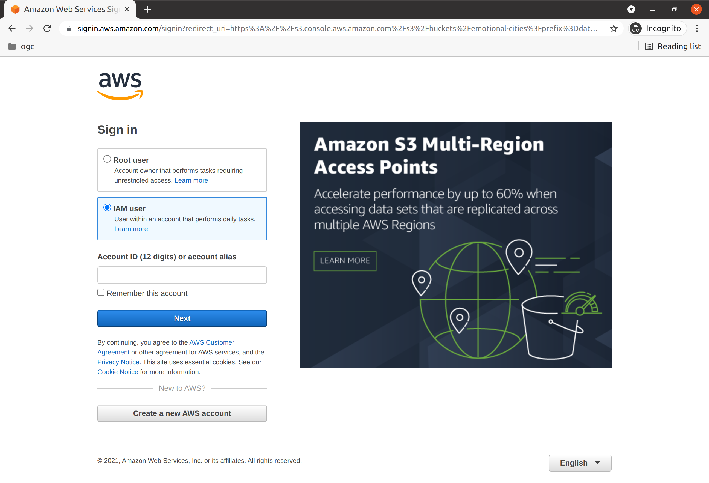
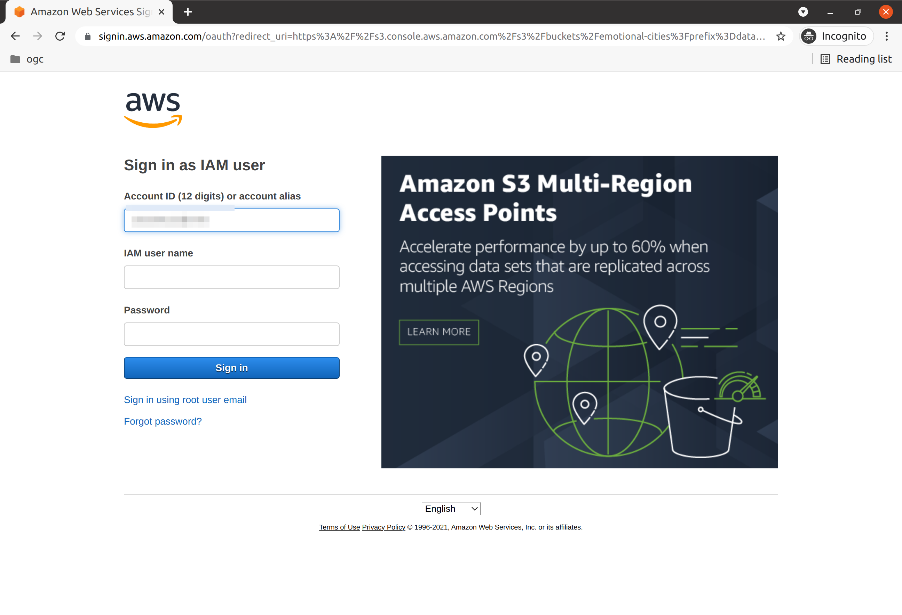
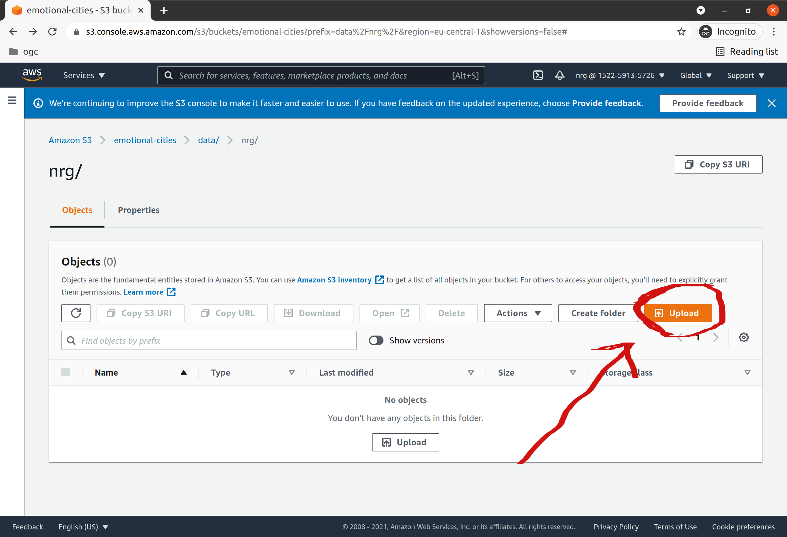

# README
## Objectives
This document provides instructions to share data, in the context of the [eMOTIONAL Cities](https://cordis.europa.eu/project/id/945307) project.

The objetive is to curate a data repository, with sample information which can be used for development purposes. **This is not intended to be a replacement for the Spatial Data Infrastructure, where the research data will be stored and shared!**

## Technology
The repository is hosted on [Amazon Web Services (AWS)](https://aws.amazon.com/), using the [Simple Storage Service (S3)](https://aws.amazon.com/s3/). It is secured using the [AWS Identity and Access Management (IAM)](https://aws.amazon.com/iam/).

## Quick-start

You can upload data to your S3 bucket folder, using a browser through the AWS console, or programatically using an application. Instructions for the two scenarios are provided bellow.
For both cases, you will need to identify yourself by providing some security information (e.g.: credentials). If you do not have this information, please get in touch with EarthPulse through the [gitter channel](https://gitter.im/emotionalcities/community), or by email.

### Access Bucket using a Browser

Open the link to the relevant folder:

https://s3.console.aws.amazon.com/s3/buckets/emotional-cities?region=eu-central-1&prefix=data/nrg/&showversions=false

(**This is just an example. Please open the link provided to you.**)

Choose the option `IAM User`, and proceed to the next screen.



Use the `username` and `password` to login.



Upload data through the user interface, using the `upload` button. You are able to create sub folders, if you like.



### Access Bucket using an application

There are multiple clients that support access to AWS S3.

On Windows, you can use the [Winscp](https://winscp.net/eng/download.php) client, to [connect to an S3 bucket, using a native protocol](https://winscp.net/eng/docs/guide_amazon_s3). In order to do that, you will need the `access key ID` and `secret access key`.


You can also install the [AWS Python shell](https://aws.amazon.com/cli/), which is available for any OS. You will need to authenticate using the provided credentials. If you are going to use AWS only for this user, you can configure the default credentials, by typing: `aws config` in your terminal.

A complete guide to using AWS CLI, can be found here:
https://docs.aws.amazon.com/cli/latest/userguide/cli-chap-welcome.html


If you plan to use this tool for multiple users, you may want to create a profile for this user. Assuming you want to call your profile `nrg`:

. Edit `~/.aws/config` (path in linux)

Insert the default region for this profile:

```
[nrg]
region = eu-central-1
```

. Edit `~/.aws/credentials` (path in linux)

Insert your credentials:

```
[nrg]
aws_access_key_id = [PASTE YOUR ACCESS KEY ID HERE]
aws_secret_access_key = [PASTE YOUR SECRET ACCESS KEY HERE]
```

To sync the files in your current folder with the folder `nrg` on the AWS bucket, you can type:

```
aws s3 sync . s3://emotional-cities/data/nrg
```

Or, if you are using a profile, append the `--profile` flag:

```
aws s3 sync . s3://emotional-cities/data/nrg --profile nrg 
```
